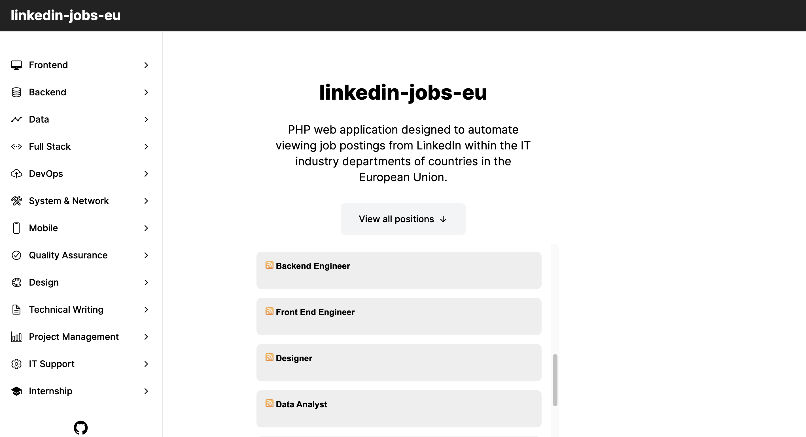

# linkedin-jobs-eu

 

**[linkedin-jobs-eu.vercel.app](https://linkedin-jobs-eu.vercel.app/)**

 

PHP web application designed to automate viewing job postings from LinkedIn within the IT industry departments of countries in the European Union. The application displays data by utilizing a [scraper widget](https://github.com/stefanicjuraj/scraper-widget) to target URLs embedded with query parameters to display the corresponding job postings.

## Departments

- **[Frontend](https://linkedin-jobs-eu.vercel.app/frontend)**

- **[Backend](https://linkedin-jobs-eu.vercel.app/backend)**

- **[Data](https://linkedin-jobs-eu.vercel.app/data)**

- **[Full Stack](https://linkedin-jobs-eu.vercel.app/full-stack)**

- **[DevOps](https://linkedin-jobs-eu.vercel.app/devops)**

- **[System & Network](https://linkedin-jobs-eu.vercel.app/system-network)**

- **[Cybersecurity](https://linkedin-jobs-eu.vercel.app/cybersecurity)**

- **[AI & Machine Learning](https://linkedin-jobs-eu.vercel.app/ai-machine-learning)**

- **[Mobile](https://linkedin-jobs-eu.vercel.app/mobile)**

- **[Game](https://linkedin-jobs-eu.vercel.app/game)**

- **[Quality Assurance](https://linkedin-jobs-eu.vercel.app/quality-assurance)**

- **[Design](https://linkedin-jobs-eu.vercel.app/design)**

- **[Technical Writing](https://linkedin-jobs-eu.vercel.app/technical-writing)**

- **[Project Management](https://linkedin-jobs-eu.vercel.app/project-management)**

- **[IT Support](https://linkedin-jobs-eu.vercel.app/it-support)**

- **[Internship](https://linkedin-jobs-eu.vercel.app/internship)**
